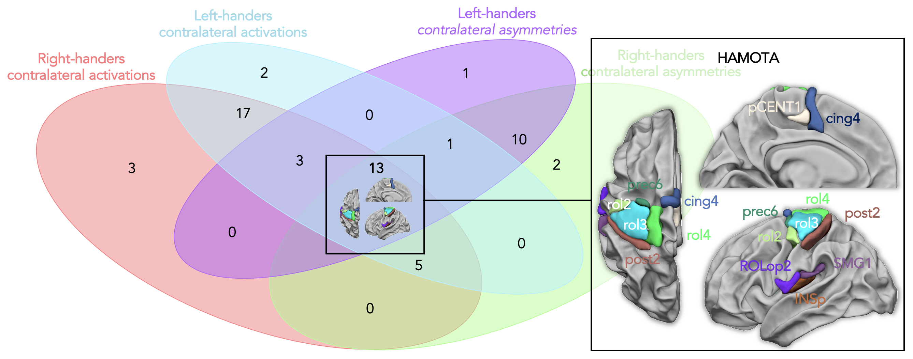

HAnd MOtor Area atlas (HAMOTA)
================

## Reference

Tzourio-Mazoyer, N., **Labache, L.**, Zago, L., Hesling, I., & Mazoyer,
B. (2021). Neural support of manual preference revealed by BOLD
variations during right and left finger-tapping in a sample of 287
healthy adults balanced for handedness. Laterality, 26(4), 398-420. DOI:
[10.1080/1357650X.2020.1862142](https://doi.org/10.1080/1357650X.2020.1862142)

------------------------------------------------------------------------

## Background

In the line of the
[SENSAAS](https://github.com/loiclabache/SENSAAS_brainAtlas) and
[WMCA](https://github.com/loiclabache/WMCA_brainAtlas) atlases that are
atlases that have bee proposed to the community on the networks
dedicated to sentence and word-list processing, the 13 regions that have
been selected and described in the present work are available as an
atlas.

**HAMOTA, HAnd MOtor Area atlas, is a brain atlas aimed to investigate
the anatomo-functional support of *handedness* (manual preference).**

To complete this investigation, a sample of 287 individuals have been
analyzed (balanced for handedness and sex). Each participant completed
both a Right Finger Tapping task (RFT) and a Left Finger Tapping task
(LFT). In order to identify areas whose activity was dependent on the
moving hand, we selected the cortical and the subcortical regions
showing activation and asymmetry favoring the hemisphere contralateral
to the moving hand during both the LFT and RFT, in right- and
left-handers. The cerebellar regions showed ipsilateral activation and
asymmetry, during both the LFT and RFT, also have been included. **13
regions were selected, including the primary and secondary sensorimotor,
and premotor cortices, thalamus, dorsal putamen and cerebellar lobule
IV. **

------------------------------------------------------------------------

## Data release

The `Atlas` folder contains 4 files:

-   `read_me_HAMOTA.rtf`: README file containing information about the
    atlas
-   `HAMOTA_MNI_ICBM_152_2mm.nii.gz`: NIfTI file containing the 13 brain
    regions in the MNI space

-   `HAMOTA_description.csv`: CSV file containing a full description of
    each areas. The first column (*Index*) correspond to the index of
    each region that is used in the NIfTI file. The second column
    (*ROI*) is the anatomical labels of each regions. Finaly, the MNI
    coordinate (columns *Xmm*, *Ymm*, *Zmm*) of each regions centroid is
    provided.

-   `template_ANTs_80tvs_on_MNI.nii.gz`: brain template used to align
    the atlas on, provided in MNI stereotaxic space (MNI ICBM 152,
    Template sampling size of 2x2x2 mm3 voxels; bounding box, x = -90 to
    90 mm, y = -126 to 91 mm, z = -72 to 109 mm)

Location of the 13 regions showed in the left hemisphere. (A) Comparison
with the map of the main effect of all finger-tapping tasks in the
meta-analysis conducted by [Witt et al,
2008](https://doi.org/10.1016/j.neuroimage.2008.04.025). The ALE maps
are shown side to side with the regions of the present atlas that are
labelled on axial slices of the left hemisphere and right cerebellum (B)
Comparison with the regions involved in the motor network for hand
movements as explored with intrinsic connectivity by [Newbold and
colleagues](https://doi.org/10.1016/j.neuron.2020.05.007) together with
lateral left hemisphere presentation of the 13 areas of the present
work.

Importantly, **the neural support of handedness is complex and does not
rely on a mirrored organization of the activity in contralateral motor
cortices associated with preferred hand movement between rigt-handers
and left-handers.**

The `Data` folder contains 2 files:

-   `readMe_data_HAMOTA.csv`: this dataset has been generated from a
    subsample of 287 participants (143 left-handers) from the [BIL&GIN
    database](https://doi.org/10.1016/j.neuroimage.2015.02.071). The
    dataset contains age, sex, self-reported manual preference
    (handedness) and Edinburgh score, for each participant. It also
    includes measures of frequencies (in Hz) when particpants performed
    self-paced right and left finger tapping tasks during an fMRI
    experiment. fMRI task-induced BOLD-signal variations and left minus
    asymmetry during right and left FTT have been computed in the
    regions of the [AICHA
    atlas](https://doi.org/10.1016/j.jneumeth.2015.07.013). The dataset
    contains BOLD signal variations in the 13 pairs of regions during
    left and right FTT, as well as several contrast between these BOLD
    variations (asymmetries, difference between dominant and minor hand,
    differences between LFT and RFT).

-   `Data_HAMOTA_TzourioMazoyer2021.csv`: full description of each
    columns of the data file (`readMe_data_HAMOTA.csv`).

------------------------------------------------------------------------

## Other atlases that might interest you

-   SEntence Supramodal Areas AtlaS:
    [SENSAAS](https://github.com/loiclabache/SENSAAS_brainAtlas)
-   Word-list Multimodal Cortical Atlas:
    [WMCA](https://github.com/loiclabache/WMCA_brainAtlas)
-   Atlas of Lateralized visuospatial Attentional Networks:
    [ALANs](https://github.com/loiclabache/ALANs_brainAtlas)
-   Atlas of Intrinsic Connectivity of Homotopic Areas:
    [AICHA](https://www.gin.cnrs.fr/en/tools/aicha/)

------------------------------------------------------------------------

## Questions

Please contact me (Loïc Labache) as <loic.labache@yale.edu> and/or
<loic.labache@ensc.fr>
